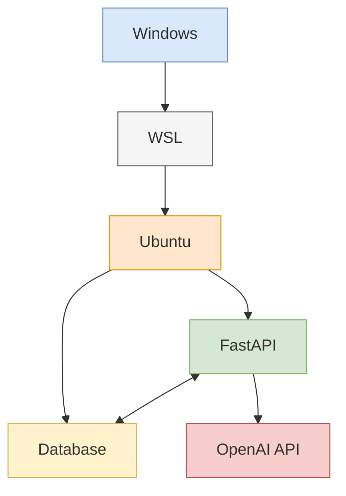

# System Architecture Diagram

This diagram represents the system architecture for the devin_tokunou project.

## Components

- **Windows**: Host operating system
- **WSL (Windows Subsystem for Linux)**: Linux compatibility layer
- **Ubuntu**: Linux distribution running on WSL
- **FastAPI**: Python web framework for building APIs
- **Database**: Database system running on Ubuntu
- **OpenAI API**: External API service for AI capabilities

## Diagram

## Connections

- **FastAPI <--> Database**: Bidirectional communication for data storage and retrieval
- **FastAPI --> OpenAI API**: FastAPI sends requests to OpenAI API for AI capabilities

## Environment

The application is hosted on Ubuntu running within WSL on a Windows host. Both FastAPI and the database are running on the same Ubuntu environment, while the OpenAI API is an external service.
